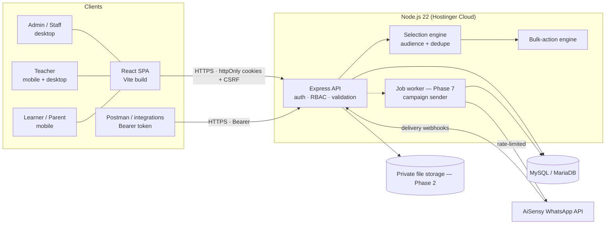
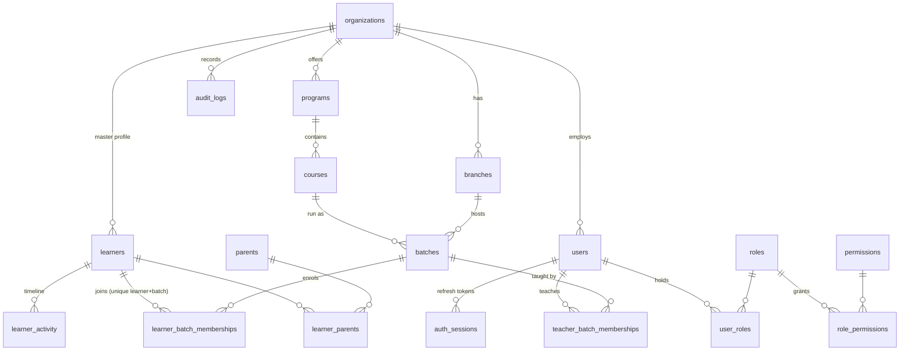
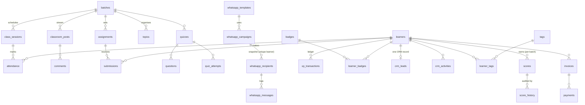
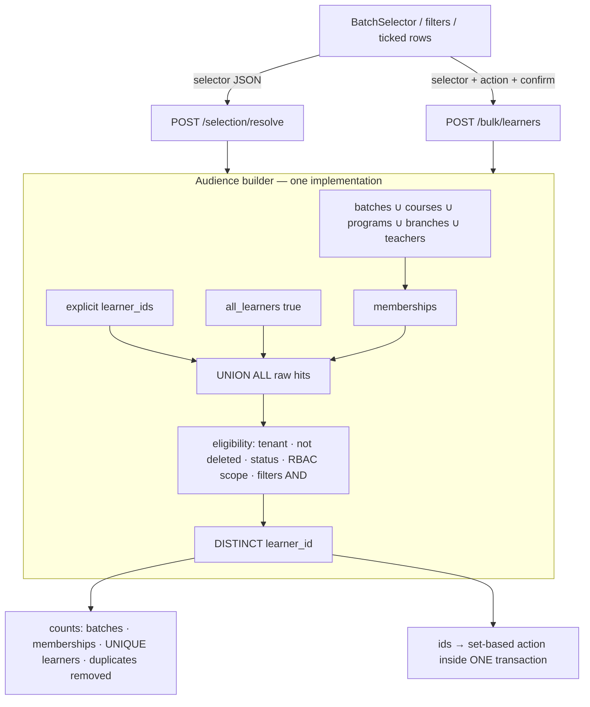

# Robokalam Learner OS — Architecture

> **One Operating System for Every Learner.**
> Status: **Phase 1 (Foundation) implemented and tested.** Phases 2–9 are designed here and intentionally **not** built yet.

Contents: 1 System · 2 Diagram · 3 Database & ERD · 4 API · 5 Folder structure · 6 RBAC matrix · 7 Learner–batch model · 8 Bulk selection · 9 Deduplication · 10 WhatsApp · 11 CRM · 12 Security · 13 Hostinger deployment · 14 Roadmap · 15 Decisions & trade-offs

---

## 1. System architecture

| Layer | Choice | Why |
|---|---|---|
| Runtime | Node.js 22, TypeScript (strict) | One language end-to-end; runs on Hostinger Cloud Node hosting. |
| API | Express 5, REST + JSON | Boring, auditable, easy to hand over. Consistent envelope `{ok,data,meta}` / `{ok:false,error}`. |
| Database | **MySQL 8 / MariaDB 10.6+** (InnoDB) | The database Hostinger provides. Composite foreign keys give tenant safety, generated columns emulate partial unique indexes, real transactions, `JSON` columns. Verified on MariaDB 10.11; written to the common subset of MySQL 8 and MariaDB. |
| Data access | `mysql2` + parameterised SQL (no ORM) | Complex set-based queries (dedupe, scope filters) stay explicit, fast and reviewable; SQL injection is prevented by construction (`Params` helper, whitelists for `ORDER BY`). Ids are UUIDs generated in the app, so no `RETURNING`/vendor-specific features are needed. |
| Validation | Zod on every request | Same schema = validation + typing. |
| Auth | bcrypt (cost 12), short-lived JWT access token + rotating opaque refresh token in DB | Sessions are revocable (logout, disable user, password change). |
| Frontend | React 19 + Vite + TypeScript, hand-written design system (CSS tokens) | Fast, no UI-kit lock-in, original Robokalam look. |
| Hosting | One Node process serves API **and** the built SPA; MySQL from hPanel | Simple to operate on Hostinger (see §13). |
| Background work (Phase 7) | MySQL-backed job queue (`SELECT … FOR UPDATE SKIP LOCKED`, MySQL 8 / MariaDB 10.6+) inside the same Node app/worker | No Redis to run on shared/cloud hosting; can be swapped for BullMQ later behind the same interface. |

Request pipeline (every `/api/*` call):

```
helmet → CORS allow-list → rate limit → JSON (1 MB) → cookies → CSRF (cookie sessions) →
authenticate (JWT + live session row + user/org status + roles/permissions) →
requireOrg (tenant pinned from the user, or X-Org-Id for super admins) →
requirePerm('…') → zod validation → service (SQL scoped by org_id + RBAC scope) → audit log (same transaction)
```

## 2. Architecture diagram



Tenant model: `organization → branches → programs → courses → batches → learners / teachers / parents`. Every business table carries `org_id`; composite FKs `(id, org_id)` make cross-tenant rows **impossible at the database level**, not just in application code.

## 3. Database

Phase 1 is implemented in `server/migrations/001_foundation.sql` (19 tables). The complete target schema for all phases is in `docs/database/later-phases-schema.sql` (33 more tables) and is verified to apply cleanly on top of 001 on MariaDB (52 tables total).

### ERD (core — implemented)



### ERD (later phases — designed)



### Key constraints (all in migration 001, all covered by tests)

| Rule | Mechanism |
|---|---|
| Learner ID unique per org | `UNIQUE (org_id, learner_code)`; code allocated atomically from `org_counters` (`RK-LRN-000124`). |
| One membership per learner+batch | `CONSTRAINT uq_learner_batch UNIQUE (learner_id, batch_id)`; re-joining re-activates the same row. |
| No cross-tenant references | Composite FKs `(learner_id, org_id)`, `(batch_id, org_id)`, … |
| No duplicate learner contact | Unique `(org_id, mobile_key)` and `(org_id, email_key)`, where `*_key` is a generated column that is NULL for deleted rows (case-insensitive collation). |
| One parent per mobile (siblings share) | Unique `(org_id, mobile_key)` on `parents` (same generated-column technique). |
| One primary parent / one lead teacher | Unique generated columns (`primary_key_`, `lead_key`) that are NULL unless the row is primary / the active lead. |
| Soft delete / history | `status` (active/inactive/archived) + `deleted_at`; memberships and activity are never deleted. |
| Indexing | org_id, status, name, created_at, mobile, email (substring search uses `LIKE`; a FULLTEXT index is the planned upgrade); membership indexes on `(batch_id,status)` and `(learner_id,status)`. |
| Transactions | Enrolment, transfer, bulk actions, create-learner (profile + parent + enrolments + timeline + audit) each run in **one** transaction. |

Migrations: plain numbered `.sql` files, applied by a tiny runner (`schema_migrations` table + `GET_LOCK`), forward-only.

## 4. API architecture

Base `/api`, JSON only. All endpoints require authentication except `POST /auth/login|refresh|logout` and `GET /health`.

| Resource | Phase 1 endpoints |
|---|---|
| `/auth` | `POST login · refresh · logout · change-password`, `GET me` |
| `/organizations` | `GET/POST` (super admin), `GET/PATCH current`, `PATCH :id/status` |
| `/branches` `/programs` `/courses` | `GET`, `POST`, `PATCH :id` |
| `/teachers` `/users` | list/create, `PATCH users/:id`, `PUT users/:id/roles`, `POST users/:id/reset-password` |
| `/learners` | `GET` (filters, sort, pagination), `POST`, `GET :id` (Learner 360), `PATCH :id`, `DELETE :id` (archive), `POST :id/restore`, `GET :id/timeline`, `POST :id/batches`, `DELETE :id/batches/:batchId`, `POST :id/transfer`, `POST/DELETE :id/parents`, `POST :id/login` |
| `/parents` | `GET`, `GET :id`, `PATCH :id`, `POST :id/login` |
| `/batches` | `GET`, `POST`, `GET :id`, `PATCH :id`, `GET :id/learners`, `POST/DELETE :id/learners`, `POST :id/teachers`, `DELETE :id/teachers/:teacherId` |
| `/selection/resolve` | **Batch selection engine** — unique-learner calculation |
| `/bulk/learners` | **Bulk-action engine** (`assign_batch`, `remove_batch`, `change_status`, `dry_run`, `confirm`) and `POST /bulk/learners/export` |
| `/dashboard` | Role dashboards (`?view=admin|teacher|learner|parent`) |
| `/audit` | Paged audit log |

Conventions: **auth** (cookie or Bearer) → **authorization** (permission + data scope) → **validation** (zod; 400 with per-field `details`) → **pagination** (`page`, `page_size ≤ 100`, `meta.total`) → **filtering/sorting** (whitelisted columns) → **errors** `{ok:false,error:{code,message,details?}}` — internal details are logged, never returned. Out-of-scope records return **404, not 403**, so IDs of other tenants/learners are not confirmable.

Later phases add `/classrooms /assignments /submissions /scores /badges /xp /attendance /materials /notifications /crm /tags /whatsapp /reports` with the same conventions.

## 5. Folder structure

```
robokalam-learner-os/
├─ README.md                      quick start
├─ .env.example                   (in server/) every variable, no secrets
├─ docs/
│  ├─ ARCHITECTURE.md             this file
│  ├─ DEPLOYMENT.md               Hostinger runbook, backups, logging
│  └─ database/later-phases-schema.sql
├─ postman/                       collection + environment (Phase 1)
├─ server/
│  ├─ migrations/001_foundation.sql
│  ├─ src/
│  │  ├─ config/env.ts            validated env (fails fast, never prints values)
│  │  ├─ db/{pool,migrate}.ts     pool, tx(), Params builder, migration runner
│  │  ├─ lib/                     errors, http helpers, audit, scope (RBAC→SQL), codes, phone, security
│  │  ├─ middleware/              auth, csrf, error
│  │  ├─ modules/<feature>/       routes.ts (+ service files)
│  │  │   auth organizations catalog users learners parents batches selection bulk dashboard audit
│  │  ├─ scripts/                 migrate, seed (super admin)
│  │  ├─ app.ts  server.ts
│  ├─ dev/                        DEV-ONLY seeders (demo org, 100k learners)
│  └─ tests/                      vitest + supertest against a real MySQL/MariaDB
└─ web/
   └─ src/{api,auth,format}.ts · components/{ui,Layout,BatchSelector}.tsx · pages/*
```

## 6. RBAC matrix

Authorization has two parts: **permissions** (what actions a role may call) and **data scope** (which rows). Scope is compiled into SQL (`lib/scope.ts`) so a missed check cannot leak rows.

| Scope rule | Roles |
|---|---|
| Whole organization | Org Admin, Counsellor/Accountant (no branch set) |
| Their branch(es) only | Branch Admin (required), Counsellor/Accountant (when a branch is set) |
| Assigned batches + the learners in them | Teacher (via **active** `teacher_batch_memberships`) |
| Own record | Learner |
| Linked children | Parent (all children, all their batches) |
| All organizations | Super Admin (must pick an org with `X-Org-Id`) |

Permissions — ✅ implemented in Phase 1, ⏳ added by the named phase.

| Capability | Super | Org Admin | Branch Admin | Teacher | Counsellor | Accountant | Learner | Parent |
|---|---|---|---|---|---|---|---|---|
| Manage organizations | ✅ | – | – | – | – | – | – | – |
| Org settings / branches | ✅ | ✅ | – | – | – | – | – | – |
| Programs & courses (manage) | ✅ | ✅ | ✅ | – | – | – | – | – |
| Staff users & roles | ✅ | ✅ | teachers/counsellors/accountants in own branch | – | – | – | – | – |
| View learners | ✅ | ✅ | branch | assigned | ✅ | ✅ (read) | self | children |
| Create / edit learners | ✅ | ✅ | branch | – | ✅ | – | – | – |
| Archive / restore learners | ✅ | ✅ | branch | – | – | – | – | – |
| Create learner/parent logins | ✅ | ✅ | branch | – | – | – | – | – |
| Create / edit batches | ✅ | ✅ | branch | – | – | – | – | – |
| Enrol / remove learners | ✅ | ✅ | branch | – | ✅ | – | – | – |
| Assign teachers to batches | ✅ | ✅ | branch | – | – | – | – | – |
| Selection engine | ✅ | ✅ | branch | assigned | ✅ | – | – | – |
| Bulk actions / export | ✅ | ✅ | branch | – | export only | – | – | – |
| Audit log | ✅ | ✅ | ✅ | – | – | – | – | – |
| Dashboards | ✅ | ✅ | ✅ | teacher | ✅ | ✅ | learner | parent |
| Assignments, submissions, scores, badges, XP | ⏳P2–4 | ⏳ | ⏳ | assigned batches | – | – | own (read/submit) | children (read) |
| Attendance | ⏳P5 | ⏳ | ⏳ | assigned batches | – | – | own (read) | children (read) |
| CRM, tags, follow-ups | ⏳P6 | ⏳ | ⏳ | – | ✅ | – | – | – |
| Communication / WhatsApp campaigns | ⏳P7 | ⏳ | ⏳ | announcements in own batches | campaigns for leads | – | – | – |
| Payments / invoices | ⏳P6 | ⏳ | ⏳ | – | – | ✅ | – | – |
| Reports | ⏳P8 | ⏳ | ⏳ | own batches | CRM | finance | – | – |

The permission keys live in the `permissions` / `role_permissions` tables (seeded in 001, extended by later migrations).

## 7. Learner–batch relationship model

```
learners (1 row per human, ever)           learner_batch_memberships                 batches
┌────────────────────────────┐             ┌──────────────────────────────┐          ┌─────────────┐
│ RK-LRN-000124  Rahul Kumar │──┐          │ learner_id ─┐  UNIQUE        │       ┌──│ Robotics A  │
│ mobile, email, school, …   │  ├────────▶ │ batch_id   ─┘ (learner,batch)│ ◀─────┤  │ Python B    │
└────────────────────────────┘  │          │ status: active|left|         │       │  │ AI Weekend  │
                                │          │   transferred|completed      │       └──│ Summer 2026 │
   one profile, N memberships ──┘          │ joined_at / left_at / reason │          └─────────────┘
```

* Joining a second batch **adds a membership**; it never creates a learner. Importing/creating a learner whose mobile or email already exists is rejected with a link to the existing profile.
* Leaving a batch sets `status='left'` (history kept); the learner stays in all other batches. Re-joining re-activates the same row.
* **Transfer** = remove (`transferred`) + enrol in **one transaction**; if the target is full or archived the whole move rolls back.
* Capacity is enforced under a row lock on the batch (`SELECT … FOR UPDATE`), so concurrent enrolments cannot oversubscribe.
* Archiving a learner ends active memberships (kept as history) and hides them from audiences; restoring does not silently re-enrol them.
* Everything learner-specific later (scores, XP, badges, attendance, CRM, payments) hangs off `learner_id` and, where relevant, a `batch_id` for context — so the 360° view aggregates across batches without any copying.

## 8. Bulk-selection architecture



Rules (all unit-tested):

* **Union of sources, AND of filters.** `batch_ids ∪ course_ids ∪ … ∪ learner_ids`, then narrowed by `filters`.
* **Empty selector = nobody.** "Everyone" requires `all_learners: true`. (Edge case "admin selects no batches".)
* Counts come from the server: `batch_memberships` = membership rows hit, `unique_learners` = `count(DISTINCT learner_id)`, `duplicates_removed` = raw hits − unique.
* **Select-all-matching-filters** sends the *filters*, not 100k ids; the server re-resolves at execution time (no stale or oversized id lists).
* Bulk actions are `dry_run` → review → `confirm: true`. Without `confirm` the API returns `CONFIRMATION_REQUIRED` with the summary; nothing runs.
* Capacity failures abort the **whole** bulk action (all-or-nothing).
* Teachers/branch admins only ever resolve audiences inside their scope — even "all learners".

The same module (`modules/selection/resolver.ts`) will feed WhatsApp, e-mail, announcements, CRM, XP and badge actions in later phases; none of them may build recipient lists any other way.

## 9. Deduplication architecture

1. **Single choke point:** audiences are produced only by `buildAudience()`; consumers read `DISTINCT learner_id`.
2. **Database guarantees** back the application rule: `UNIQUE(learner_id,batch_id)`, and — for Phase 7 — `UNIQUE(campaign_id, learner_id)` **and** `UNIQUE(campaign_id, phone)` on `whatsapp_recipients`, so even a bug cannot send a campaign twice to the same learner or phone (siblings sharing a parent phone are collapsed to one message with merged variables).
3. **Snapshot:** a campaign freezes its recipient list at confirmation time (`whatsapp_recipients`); later batch changes never alter an in-flight campaign.
4. **Contact dedupe at creation:** learner mobile/email unique per org; parent unique per mobile.

## 10. WhatsApp architecture (Phase 7 — designed, not built)

```
Admin picks audience (selection engine) → Campaign REVIEW screen (batches, memberships, unique learners,
duplicates removed, recipients, template)  → [Confirm & Send]   (no confirmation ⇒ cannot be sent)
   → transaction: create whatsapp_campaigns(confirmed_at) + snapshot whatsapp_recipients (unique by learner & phone)
   → worker loop: claim N pending recipients (FOR UPDATE SKIP LOCKED) → AiSensyService.sendTemplateMessage()
         respects provider rate limit (token bucket), retries with exponential back-off (max attempts), honours cancellation
   → AiSensy webhook → POST /api/whatsapp/webhook (HMAC/secret verified, idempotent via webhook_events) → update recipient/message status
   → campaign status rolls up: processing → completed | partially_failed | failed | cancelled
```

* `AiSensyService` (backend only): `sendTemplateMessage`, `sendBulkTemplateMessages` (chunked, never one giant HTTP call), `getMessageStatus`, `processWebhook`, `validateRecipient` (E.164 India), `logMessage`. Config from `AISENSY_API_KEY`, `AISENSY_BASE_URL`, `AISENSY_WA_NUMBER` — already reserved in `.env.example`; **never** sent to the browser.
* Templates cover the 16 use-cases (welcome, enrolment, reminders, evaluated, badge, attendance alert, fee, announcement, …) with named variables; each maps to an AiSensy campaign name.
* Every attempt is logged in `whatsapp_messages`; the UI shows total / successful / failed / pending per campaign.

## 11. CRM architecture (Phase 6 — designed, not built)

* **One CRM record per learner** (`crm_leads.learner_id UNIQUE`): source, status (New → … → Converted/Lost), interests, counsellor, temperature, next follow-up. Leads are not a separate person table — a lead *is* a learner profile, so conversion never copies data.
* `crm_activities` (call, WhatsApp, demo, fee discussion, admission, …) with staff, time, next follow-up; `follow_ups` drive the counsellor's task list.
* **Bulk CRM** (activity / counsellor / tag / follow-up / campaign) reuses the selection engine, so batch overlap never double-logs a learner.
* Tags: `tags` + `learner_tags` (unique pair), filterable in the same global filter engine.

## 12. Security architecture

| Concern | Implementation |
|---|---|
| Passwords | bcrypt cost 12; policy ≥10 chars with upper/lower/digit; generated temp passwords force change; reset revokes all sessions. |
| Sessions | 15-min JWT access token + opaque 7-day refresh token (stored as SHA-256 hash), **rotated on use** (replay fails), session row checked on every request (instant revocation). |
| Brute force | Per-account lockout (8 failures → 15 min), per-IP login limiter, global API limiter, constant-time-ish unknown-user path, generic error text. |
| CSRF | Cookies `httpOnly; SameSite=Lax; Secure(prod)`; double-submit `X-CSRF-Token` required for cookie-authenticated writes; Bearer clients exempt. |
| XSS | React escapes output; strict CSP via helmet; no `dangerouslySetInnerHTML`; API returns JSON only. |
| SQL injection | Parameterised queries everywhere; dynamic `ORDER BY`/column names come only from server-side whitelists; verified by test. |
| Tenant isolation | org pinned from the authenticated user (spoofed `X-Org-Id` is ignored for non-super-admins); every query filters `org_id`; composite FKs; 404 on foreign ids. |
| Authorization | Permission middleware + SQL data scope; learners/parents only see own/linked records; tested for teacher/learner/parent/branch-admin/counsellor. |
| Input | zod on all bodies/queries; page-size caps; 1 MB body limit; mobile/email normalisation. |
| Export safety | CSV cells starting with `= + - @` are neutralised (formula injection). |
| Secrets | Env-only; startup validation prints variable *names* never values; `.env` git-ignored; logger redacts auth headers/passwords. |
| Headers / CORS | helmet (CSP, HSTS in prod, no-sniff, frame-ancestors), explicit CORS allow-list with credentials. |
| Files (Phase 2) | Extension + MIME allow-list, size caps, random storage keys, private storage, signed short-lived URLs; storage paths never returned. |
| Audit | Append-only `audit_logs` written **in the same transaction** as the change (actor, action, entity, before/after, IP, UA): learner created/updated/archived, batch assigned/removed, teacher assigned/removed, permission changed, user created/disabled, org changes, login success/failure, exports, bulk actions. |

## 13. Hostinger deployment architecture

See **`docs/DEPLOYMENT.md`** for the step-by-step runbook (Hostinger Node.js app or VPS, MySQL, env vars, build, migrations, domain + SSL, backups, logging).

```
Browser ──HTTPS(443)──▶ Hostinger edge / nginx (TLS, gzip) ──▶ Node :PORT (Express)
                                                       ├─ serves web/dist (SPA, immutable assets)
                                                       └─ /api/* ──▶ MySQL (localhost)
```

## 14. Phase-by-phase roadmap

| Phase | Scope | Status |
|---|---|---|
| **1 Foundation** | Tenancy, auth, RBAC, admin/teacher/learner/parent, master learner DB, Learner 360, batches, learner/teacher memberships, batch selection + unique-learner calc, bulk assign/remove/status/export, role dashboards, audit | ✅ **Done & tested** |
| 2 Classroom | Stream, classwork/topics, people, materials, assignments, submissions, private file storage | next |
| 3 Assessment | Manual scoring, score history, gradebook, quizzes, feedback | |
| 4 Gamification | XP ledger, badges, levels, achievement wall, leaderboard | |
| 5 Attendance & Parent | Class sessions, attendance, parent portal expansion, notifications, learner analytics | |
| 6 CRM | Leads, tags, CRM activities, follow-ups, payments/invoices | |
| 7 Communication | Announcements, AiSensy, templates, campaigns, recipient snapshot/dedupe, logs, webhooks, e-mail | |
| 8 Analytics | Dashboards, cross-batch analytics, learner/batch analytics, reports (CSV/Excel/PDF-ready), global search, CSV import | |
| 9 Hardening | Load tests, caching, backups automation, monitoring, full Postman, docs | |

Items from the brief that are deliberately **not** in Phase 1 (no placeholder UI for them): scores/XP/badges/attendance columns, tags/CRM/CRM-status filters, WhatsApp/e-mail/announcement bulk actions, CSV import, global search, reports.

## 15. Decisions & trade-offs

* **MySQL/MariaDB because that is what Hostinger offers.** The schema avoids features the two servers do not share: ids are app-generated UUIDs (`VARCHAR(36)`), "partial unique" rules use `STORED` generated columns that are `NULL` when a rule does not apply (a UNIQUE index ignores NULLs), upserts use `ON DUPLICATE KEY UPDATE`, there is no `RETURNING`, no `LATERAL`, no ordered `JSON_ARRAYAGG`. Every transaction runs `READ COMMITTED` and locks the batch row before capacity checks. MySQL cannot roll back DDL, so migrations are small forward-only files recorded after they succeed.
* **Learner mobile/email are unique per organization.** A learner without their own number should be created without a mobile and reached through the parent. Shared family phones belong on the *parent*, which is deduplicated by mobile (siblings share one parent).
* **Archive instead of delete.** `deleted_at` is reserved for future "created by mistake" removals by a super admin; normal lifecycle uses `status`.
* **Offset pagination.** Fine to 100k+ learners with the indexes above (measured: list ≤ 0.4 s at 100k learners / 100k memberships, name-search ≈ 0.3 s). Keyset pagination is the planned upgrade if lists grow by an order of magnitude.
* **Classes derived from the batch schedule** (weekday + time) power "today's classes" until Phase 5 introduces concrete `class_sessions`.
* **Learner/parent logins are opt-in** (created by staff, temp password shown once). Self-service password reset by e-mail arrives with the Phase 7 e-mail channel.
